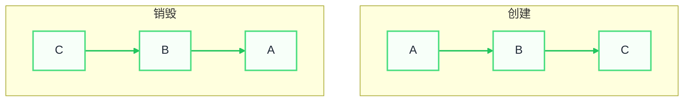
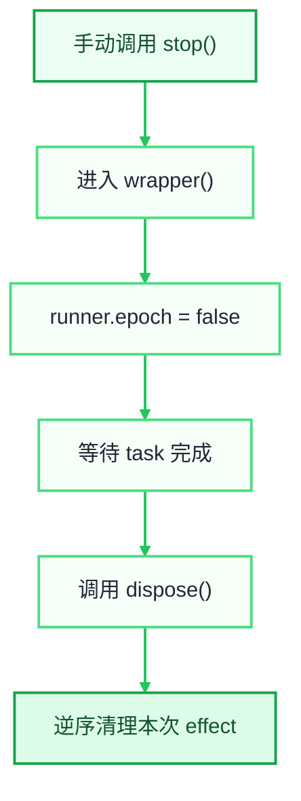
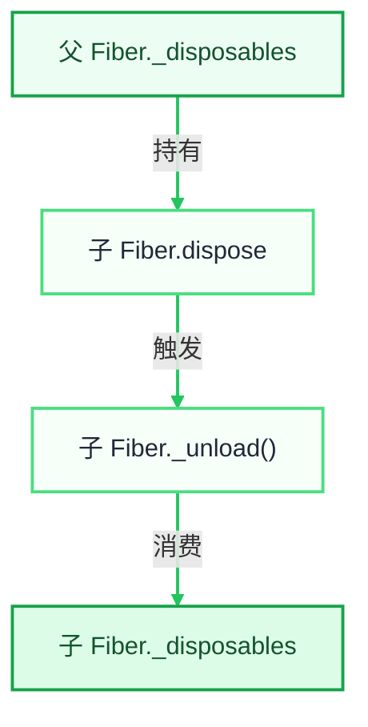
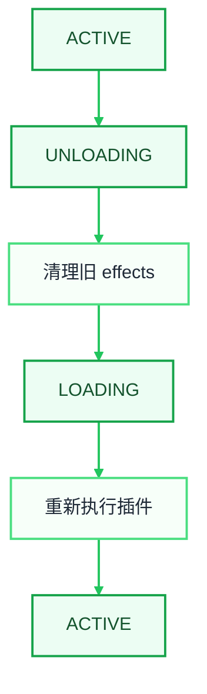
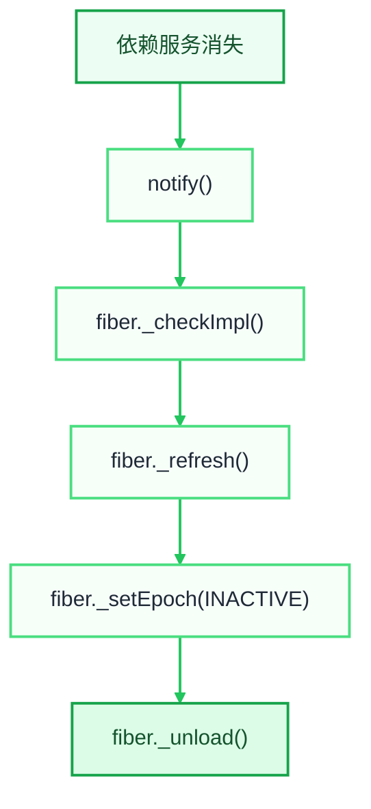
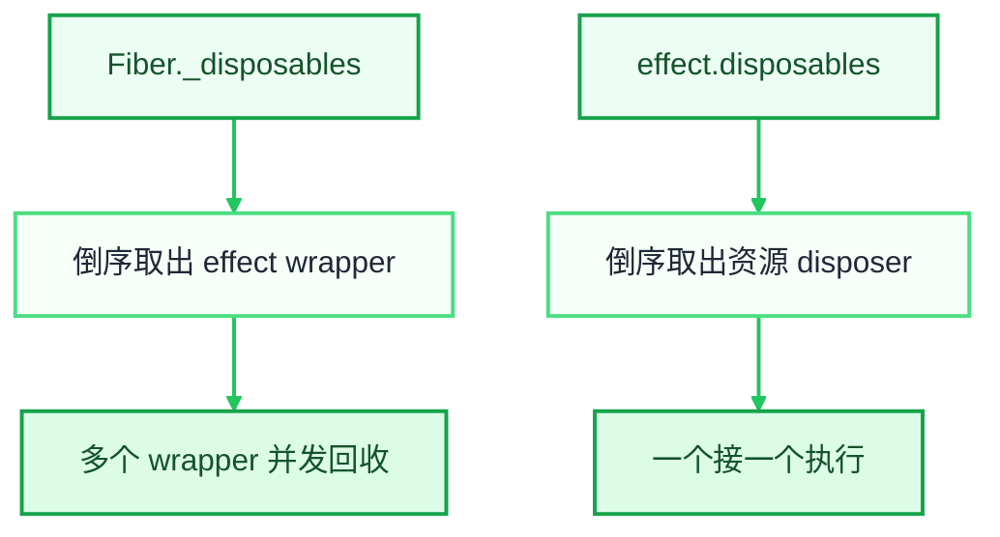
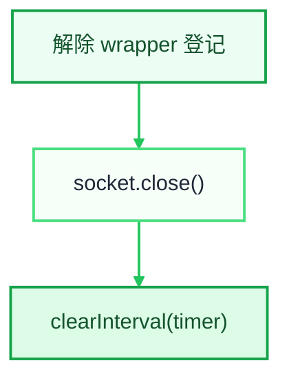

> FYI：本文是深层次的解读和探索，入门教程可以先移步[官方文档](https://deepseek-harness.github.io/deepseek-harness/develop/cordis-tutorial/02-lifecycle-and-effects)

[上一篇文章](https://shijayhuo.github.io/posts/cordis-plugin-guide/)谈到了 Cordis 的可逆性，这个是与其他插件系统最大的不同，而且在实现中它贯穿了很多API，底层都保证着这一特性，所以有必要对它做一次探索，本文依旧从文档到底层代码的思路捋这件事。

# 什么是可逆性？
简单来说可逆性就是**回收资源的能力**。插件可以被安全地加入，也可以被完整地移除，而且移除一个插件不会把系统留下“脏状态”。

> FYI：作者在 [可逆的插件系统](https://koishi.chat/zh-CN/cookbook/design/disposable.html#%E5%8F%AF%E9%80%86%E7%9A%84-koishi) 的解释。

显然上一篇文章举例说的 Koa 和 Slate.js 也不具备可逆性。

> Koa 和 Slate.js 解决的是插件编排组合和执行的问题，但没有任何API或底层处理中间件的卸载和资源回收。

我们知道程序或者插件内部程序很多时候会有作用域和嵌套的情况，依赖起来就像一颗树，所以能不能把这颗树回收干净才是一个难点。

# 底层核心：Effect
其实可逆性这一点，我开始并没有注意，只是想了解全貌，但当我看到[这一篇官方文档](https://deepseek-harness.github.io/deepseek-harness/develop/cordis-tutorial/02-lifecycle-and-effects)时，我开始理解了好像这是 Cordis 非常重要的 API，因为生命周期贯穿插件运行的整个链路。

```typescript
export function apply(ctx: Context) {
  // ...
  ctx.effect(() => {
    const timer = setTimeout(async () => {
      console.log('disposed')
      process.exit(0)
    }, 700)
    return () => clearTimeout(timer)
  })
}
```

嘿，熟悉感一下来了，这不是 react 的 useEffect 嘛，所以，第一时间问了一下 AI： cordis 的 effect 和 react 的 useEffect 有什么相同点和不同点。总结了一下是：

+ 相同点：
    - 思想内核几乎是同一类东西，但解决问题的层级不同
    - 都是「副作用 + 生命周期 + 清理」
    - 它们共同的重要思想是 **ownership**
    - 都是依赖变化 → 撤销旧 effect → 创建新 effect
+ 不同点：
    - React useEffect 是「组件生命周期」，Cordis Effect 是「插件系统生命周期」
    - Cordis 是长期运行的、动态变化的插件系统，React `useEffect` 是响应式重新执行的

在去[这一篇官方文档](https://deepseek-harness.github.io/deepseek-harness/develop/cordis-tutorial/02-lifecycle-and-effects)确认实现原理和细节时，发现它只说明了它会在**插件****<font style="color:rgb(60, 60, 67);">修改配置、热重载、显式资源释放或所需服务消失而卸载</font>**<font style="color:rgb(60, 60, 67);">和</font>销毁哪些内容，但并没有清晰的说明它是如何执行的，也没有找到具体的官方说明，所以，我决定从源码探索。

# 源码分析可逆性原理
作者也有解释[可逆的插件系统 | Koishi](https://koishi.chat/zh-CN/cookbook/design/disposable.html#%E5%AE%9E%E7%8E%B0%E5%8E%9F%E7%90%86)，但主要用数学做演示，我看的费劲，先简单做个示例：



## 源码探究
### Fiber.effect


上图是通过源码整理出来的，可以先简单看一下，推荐后面看源码的时候可以频繁对照理解，下面简化了[源码](https://github.com/cordiverse/cordis/blob/b912d3997ab8e819f8b112edc0b8ee0dfd77132d/packages/core/src/fiber.ts#L275)，伪代码如下：

```typescript
effect(execute: () => Effect) {
  // 声明一个栈/桶，装需要清理的任务
  const disposables: Disposable[] = []

  const dispose = async () => {
    // 重点：逆行（弹出栈/桶里的任务）消费/清理
    for (const fn of disposables.splice(0).reverse()) {
      await fn()
    }
  }

  const runner = {
    // ...
    collect: (fn: Disposable) => {
      disposables.push(fn)
      this._disposables.delete(fn)
    },
  }

  let task: void | Promise<void>

  try {
    // 下文会讲到
    task = this._execute(runner)
  } catch (error) {
    void dispose()
    throw error
  }

  void task?.catch(dispose)

  const wrapper = () => {
    if (!runner.epoch) return

    runner.epoch = false
    return task ? task.then(dispose) : dispose()
  }

  // 压栈进去
  disposables.push(this._disposables.push(wrapper))

  return wrapper
}
```

### Fiber._execute 干了啥
_execute 代码看起来很长，但本质上只干了两件事：

1. 执行 runner.execute 函数：`runner.execute.call(this)`
2. 执行 `runner.collect(dispose)` 函数

```typescript
private _execute<T>(runner: EffectRunner<T>) {
    // ...
    // composeError 函数的语法糖，目的是安全防止函数执行，不用太关注
    return composeError((info) => {

      // safeCollect 等价于直接执行 runner.collect(dispose)，只是捕获了异常情况
      const safeCollect = (dispose: void | Disposable) => {
        if (typeof dispose === 'function') {
          runner.collect(dispose)
        } else if (!isNullable(dispose)) {
          throw new TypeError('Invalid effect')
        }
      }

      // 重点：执行 execute 函数
      const effect: Effect = runner.execute.call(this)

      // 处理 effect 四种形式，最终的目的都是调用 runner.collect(effect)
      // 1. 普通函数
      if (typeof effect === 'function') {
        return runner.collect(effect)
      }

      // 2. PromiseLike
      else if ('then' in effect) {
        return effect.then(safeCollect)
      }

      // 3. 迭代器
      else if (Symbol.iterator in effect) {
        info.error = new Error()
        const iter = effect[Symbol.iterator]()
        while (true) {
          const result = iter.next()
          safeCollect(result.value)
          if (result.done) return
        }
      }

      // 4. 异步迭代器
      else if (Symbol.asyncIterator in effect) {
        const iter = effect[Symbol.asyncIterator]()
        return (async () => {
          // force async stack trace
          await Promise.resolve()
          info.error = new Error()
          while (true) {
            if (runner.epoch !== oldEpoch) return
            const result = await iter.next()
            safeCollect(result.value)
            if (result.done) return
          }
        })()
      }
    }, runner.getOuterStack)
  }
```

同时这段代码可以退出来使用 effect 的函数可以有4 种形式，比如:

#### 普通函数式
```typescript
ctx.effect(() => {
  return () => cleanupA()
})
```

#### 元素是函数的迭代器
```typescript
ctx.effect(() => {
  return [
    () => cleanupA(),
  ]
})

ctx.effect(function* () {
  yield () => cleanupA()
  yield () => cleanupB()
})

```

#### Promise 函数
```typescript
ctx.effect(async () => {
  return async () => {
    cleanupA()
  }
})
```

#### 异步迭代器
```typescript
ctx.effect(async function* () {
  yield () => {
    cleanupA()
  }
})
```

### 到底是谁调用 dispose
到这里 effect 的注册过程就比较清楚了：`execute` 负责创建资源，`collect` 负责收集清理函数，最后返回一个 `wrapper`。但还有一个最关键的问题：**到底是谁调用这个 `wrapper`**？

先区分两个容易混在一起的概念：

+ `ctx.effect()` 返回的 `wrapper`，只负责清理这一次 effect。
+ `fiber.dispose()` 负责永久销毁整个插件实例，它会继续触发这个 Fiber 上的全部 effect。

#### 手动停止某一个 effect
最直接的入口就是调用 `ctx.effect()` 的返回值：

```typescript
const stop = ctx.effect(() => {
  const timer = setInterval(() => {
    console.log('tick')
  }, 1000)

  return () => clearInterval(timer)
})

await stop()
```

这里调用的 `stop()` 就是源码里的 `wrapper()`，它会把 `runner.epoch` 改成 `false`，保证只执行一次，然后等待异步初始化完成，最后调用内部的 `dispose()`。



这个入口只会停止一个 effect，插件本身依旧处于运行状态。

#### 销毁整个插件 Fiber
插件整体回收的入口是 `fiber.dispose()`，它是在创建 Fiber 时通过父 Fiber 的 effect 生成的：

```typescript
this.dispose = parent.fiber.effect(() => {
  // 当前插件实例登记到 runtime
  const remove = runtime.fibers.push(this)

  // 插件满足依赖后开始加载
  this.config = resolveConfig(runtime, config)
  this._refresh()

  // 这才是插件真正的销毁逻辑
  return async () => {
    this.uid = null
    this.context.emit('internal/plugin', this)

    remove()
    this._setEpoch(INACTIVE)

    while (this.inertia) {
      await this.inertia
    }
  }
}, 'ctx.plugin()')
```

源码在 [Fiber 构造函数](https://github.com/cordiverse/cordis/blob/b912d3997ab8e819f8b112edc0b8ee0dfd77132d/packages/core/src/fiber.ts#L158-L187)。这里有一个非常重要的关系：**子插件的 `fiber.dispose`，本身就是父 Fiber 持有的一个 effect。**



所以插件的作用域确实是一棵树。父插件被回收时，它持有的子插件 `dispose` 也会被调用，然后继续清理子插件内部的监听器、定时器、服务和其他子插件，这样一直向下递归。

### 插件回收在什么时候触发
明白 `fiber.dispose()` 和 `_unload()` 的关系后，再看触发时机就清晰了。插件资源回收并不只有“删除插件”这一种情况，而是分成永久销毁和临时卸载两类。

#### 显式调用 fiber.dispose
插件可以主动停止自己，也可以由持有它的代码停止：

```typescript
await ctx.fiber.dispose()

// 或者
const fiber = ctx.plugin(myPlugin)
await fiber.dispose()
```

调用以后 `uid` 会被设为 `null`，然后进入 `_unload()`。这表示插件实例已经永久销毁，清理结束后不会再次加载。

#### 父 Fiber 被卸载
因为子插件的 `fiber.dispose` 保存在父 Fiber 的 `_disposables` 中，所以父 Fiber 卸载时会自动调用它。应用停止时通常先回收根 Fiber，然后沿着这条所有权链逐层向下回收全部插件。

#### Loader 删除、禁用或替换插件
Loader 删除配置项、禁用插件或者热更新插件时，最终也要拿到对应 Fiber 并调用 `fiber.dispose()`。Cordis 的注册表同样提供了删除入口：

```typescript
delete(plugin: Plugin) {
  const runtime = this.get(plugin)
  if (!runtime) return

  this._internal.delete(runtime.callback)

  for (const fiber of runtime.fibers) {
    fiber.dispose()
  }
}
```

源码在 [RegistryService.delete](https://github.com/cordiverse/cordis/blob/b912d3997ab8e819f8b112edc0b8ee0dfd77132d/packages/core/src/registry.ts#L152-L160)。所以热重载也不是直接寻找 timer、listener 去清理，它只需要找到旧 Fiber，后面的资源回收全部交给 Fiber 自己完成。

#### 修改配置或主动 restart
修改配置和热重载有时不需要永久删除 Fiber，而是让同一个 Fiber 先卸载旧资源，再重新执行插件。入口是 `restart()`：

```typescript
async restart() {
  const fiber = this.ctx.fiber

  fiber._setEpoch(INACTIVE)
  fiber._refresh()

  await fiber.await()
}
```

这条链路中 `uid` 没有变成 `null`，所以 Fiber 仍然存在，只是发生了一次：



#### 插件依赖的服务消失
Cordis 的插件可以通过 `inject` 声明依赖。当某个 `ctx.provide()` 提供的服务被回收时，它会通知所有依赖这个服务的 Fiber：

```typescript
return async () => {
  delete this.store[key]

  const fibers = this.notify([name])
  await Promise.allSettled(
    fibers.map(fiber => fiber.await()),
  )
}
```

`notify()` 会重新检查依赖并调用 `_refresh()`：

```typescript
fiber._checkImpl(name)
fiber._refresh()
```

源码在 [ReflectService.provide](https://github.com/cordiverse/cordis/blob/b912d3997ab8e819f8b112edc0b8ee0dfd77132d/packages/core/src/reflect.ts#L160-L209)。依赖缺失时 `_refresh()` 会把 epoch 计算成 `INACTIVE`，接着触发 `_unload()`：



这也是临时卸载。Fiber 会停在 `PENDING`，服务重新出现后再执行 `_reload()`，插件会重新创建一套资源。

#### 初始化过程中报错
前面 effect 的源码中已经出现了两条异常回收链路：同步报错走 `catch`，异步报错走 `task.catch(dispose)`。它们只清理这一次 effect 已经成功登记的资源。

如果报错继续冒泡到插件的 `_reload()`，Fiber 会把 epoch 设为 `INACTIVE`，再调用 `_unload()` 清理插件启动过程中已经登记的其他 effect。也就是说，即使插件只初始化了一半，已经创建的那一半资源也仍然可以回滚。

### 触发后如何执行回收
手动 `stop()` 会直接进入单个 effect 的 wrapper，不经过 Fiber 状态切换。插件级别的回收入口才会汇聚到 `_setEpoch()`，由它根据新旧 epoch 决定是加载还是卸载：

```typescript
private _setEpoch(epoch: string) {
  const oldEpoch = this._runner.epoch
  if (epoch === oldEpoch) return

  this._runner.epoch = epoch

  if (epoch !== INACTIVE && oldEpoch === INACTIVE) {
    this.inertia = this._reload()
  } else {
    this.inertia = this._unload()
  }
}
```

这里可以把 epoch 理解为 Fiber 当前依赖环境的版本。依赖从不可用变成可用，就 `_reload()`；依赖消失、实现发生变化或者主动 restart，就先 `_unload()`。

真正消费插件总清理清单的是 `_unload()`：

```typescript
private async _unload() {
  await Promise.all(
    this._disposables.clear().map(async (dispose) => {
      try {
        await dispose()
      } catch (error) {
        this.ctx.logger.error(error)
      }
    }),
  )

  this.store = undefined
}
```

`this._disposables.clear()` 会先清空 Fiber 的清理清单，然后把里面的 wrapper 倒序返回：

```typescript
clear() {
  const values = [...this.map.values()]
  this.map.clear()
  return values.reverse()
}
```

源码在 [DisposableList.clear](https://github.com/cordiverse/cordis/blob/b912d3997ab8e819f8b112edc0b8ee0dfd77132d/packages/core/src/utils.ts#L24-L28)。这样 Fiber 就不再持有已经进入回收流程的 effect，同时后登记的 wrapper 会先被取出。

但是这里还有一个容易忽略的细节：`_unload()` 使用了 `Promise.all()`。所以 Fiber 层面是**倒序取出多个 effect，但并发等待它们完成**；单个 effect 内部的 `disposables` 才是严格的逆序串行消费。



因此，如果 timer 和 socket 分别属于两个独立的 `ctx.effect()`，不能依赖它们关闭完成的先后顺序。如果它们确实存在顺序要求，就应该放进同一个 effect：

```typescript
ctx.effect(function* () {
  const timer = setInterval(tick, 1000)
  yield () => clearInterval(timer)

  const socket = createSocket()
  yield () => socket.close()
})
```

注册完成后，这个 effect 的局部清理清单可以理解为：

```plain
[
  clearInterval(timer),
  socket.close(),
  从 Fiber._disposables 解除 wrapper 登记,
]
```

调用 wrapper 后会逆序执行：



如果是手动调用 `stop()`，第一步会保证 Fiber 将来卸载时不会再次消费这个 wrapper；如果是 Fiber 整体卸载，`clear()` 已经提前清空总清单，这一步不会产生额外影响。

### 从开始到结束再捋一遍
最后把插件的一次完整生命周期串起来：

<picture>
  <source srcset="/assets/img/posts/2026-09-01/cordis-plugin-lifecycle-flow.svg" type="image/svg+xml">
  
</picture>

# 总结
到这里 Cordis 可逆性的整个闭环就完整了。`effect` 本身不负责判断插件什么时候应该卸载，它只把“创建资源”和“如何撤销资源”绑定成一个可调用的 wrapper；Fiber 负责持有这些 wrapper，并在生命周期变化时统一消费；父 Fiber 又持有子 Fiber 的 `dispose`，最终形成一棵可以从任意节点向下完整回收的所有权树。

所以可逆性的核心并不是简单地提供一个 `dispose()` API，而是三个环节必须同时成立：

+ 每次创建资源时就登记对应的清理方法。
+ 每个清理方法都有明确的 Fiber 所有者。
+ 生命周期变化最终一定汇聚到 `_unload()`，消费这个所有者持有的全部清理任务。

回头再看最开始的那句话，创建是 `A → B → C`，销毁是 `C → B → A`。Cordis 做的事情，就是把这个顺序和所有权关系固化进 Fiber 和 effect，让插件无论是主动停止、被热替换、依赖失效还是随父插件一起退出，最终都进入同一套可等待、可回滚的清理机制。

# 番外：哪些操作已经属于 effect

[官方文档](https://deepseek-harness.github.io/deepseek-harness/develop/cordis-tutorial/02-lifecycle-and-effects)还有一个很实用的提醒：实际写插件时，很少需要亲自调用 `ctx.effect()`。很多注册 API 已经在内部把“添加资源”和“撤销资源”绑定成了 effect。

换句话说，下面这些调用虽然表面上不是 `ctx.effect()`，但最终都会把 disposer 挂到当前插件的 Fiber 上：

| 注册 API | 创建的资源 | 插件卸载时发生什么 |
| --- | --- | --- |
| `ctx.on(event, listener)` | 事件监听器（[第 4 章](https://deepseek-harness.github.io/deepseek-harness/develop/cordis-tutorial/04-events)） | 从事件列表中移除 listener |
| `ctx.plugin(child)` | 子插件 Fiber | 调用子 Fiber 的 `dispose()` |
| `ctx.provide(name, service)` | 服务实现 | 删除服务并通知依赖它的 Fiber |
| `ctx.tools.register(tool)` | Harness 工具定义（[第 7 章](https://deepseek-harness.github.io/deepseek-harness/develop/cordis-tutorial/07-into-the-harness)） | 从当前作用域的工具表中撤销注册 |

官方文档的这一段也可以在 [GitHub 文档源码](https://github.com/deepseek-ai/deepseek-harness/blob/cd5ef8148158c3a752a658978873241fdf8e2bbc/docs/cordis-tutorial/02-lifecycle-and-effects.zh.md#L84-L94) 中查看。下面简单扫一下源码部分。

## `ctx.on()`


所以 `ctx.on()` 返回的函数不是额外赠送的工具，而是这个 listener 对应的 effect wrapper。手动调用它会移除监听器；插件卸载时，Fiber 也会自动调用它。源码见 [Events.register 与 Events.on](https://github.com/cordiverse/cordis/blob/b912d3997ab8e819f8b112edc0b8ee0dfd77132d/packages/core/src/events.ts#L128-L160)。

## `ctx.plugin()`


这里是 `ctx.plugin()` 的直接入口。[`RegistryService.plugin()`](https://github.com/cordiverse/cordis/blob/b912d3997ab8e819f8b112edc0b8ee0dfd77132d/packages/core/src/registry.ts#L193-L212) 负责校验插件、创建或复用 runtime，再通过 `new Fiber()` 创建子 Fiber，并返回一个可以等待加载完成的包装对象。

父子 Fiber 的清理关系并不在 `wrapped.then` 中建立，而是在进入 [`Fiber` 构造函数](https://github.com/cordiverse/cordis/blob/b912d3997ab8e819f8b112edc0b8ee0dfd77132d/packages/core/src/fiber.ts#L170-L199) 后，通过 `parent.fiber.effect()` 把子 Fiber 的 `dispose` 登记到父 Fiber。

## 服务和 Harness 注册表：注册本身也是资源


`ctx.provide()` 同样直接调用当前 Fiber 的 `effect()`。创建阶段把服务实现写入 store，清理阶段删除服务并通知依赖它的 Fiber。完整实现见 [`ReflectService.provide()`](https://github.com/cordiverse/cordis/blob/b912d3997ab8e819f8b112edc0b8ee0dfd77132d/packages/core/src/reflect.ts#L175-L202)。

DeepSeek Harness 的注册表沿用了同一套做法。以 `ctx.tools.register()` 为例，省略 layer 创建和变更通知后，它把工具写入操作返回的 undo 继续交给 `ctx.effect()`：

```typescript
// ToolService.register()
return this.layers.effect(
  this.ctx,
  layer => layer.tools.insert(name, definition),
  { label: 'tools.register()' },
)

// ScopedLayers.effect()
const dispose = ctx.effect(function* () {
  const undo = action(layer)
  yield () => undo()
}, options.label)
```

完整实现见 [`ToolService.register()`](https://github.com/deepseek-ai/deepseek-harness/blob/cd5ef8148158c3a752a658978873241fdf8e2bbc/packages/core/tools/src/index.ts#L1036-L1060) 和 [`ScopedLayers.effect()`](https://github.com/deepseek-ai/deepseek-harness/blob/cd5ef8148158c3a752a658978873241fdf8e2bbc/packages/core/scope/src/store.ts#L226-L265)。

## 什么时候需要亲自写 `ctx.effect()`

判断方法很简单：如果资源由 Cordis 或 Harness 的注册 API 创建，就直接使用那个 API；如果资源来自框架之外，就需要自己说明如何释放。常见例子包括定时器、WebSocket、文件句柄、子进程和第三方 SDK 的订阅。

```typescript
ctx.effect(async () => {
  const transport = await openTransport()
  const timer = setInterval(tick, 1000)

  return async () => {
    clearInterval(timer)
    await transport.flush()
    await transport.close()
  }
})
```

这里把三个有先后要求的步骤放进同一个异步 disposer：先停 timer，再等待 transport flush，最后关闭连接。这样顺序由这个函数自己保证。

如果把它们拆成三个独立 effect，Fiber 卸载时只保证 wrapper 按注册顺序逆序取出，多个异步 wrapper 仍可能并发运行。要依赖严格的拆除顺序，就不要让它们分散到不同 effect 中。

因此，“已经属于 effect”真正表达的是所有权，而不是 API 名字。只要一个注册操作能找到当前 Fiber，并把对应的撤销函数交给它，这项资源就已经进入 Cordis 的可逆生命周期。

# 参考

+ [DeepSeek Harness Cordis 教程：生命周期与 Effect](https://deepseek-harness.github.io/deepseek-harness/develop/cordis-tutorial/02-lifecycle-and-effects)
+ [DeepSeek Harness Cordis 教程：事件系统](https://deepseek-harness.github.io/deepseek-harness/develop/cordis-tutorial/04-events)
+ [DeepSeek Harness Cordis 教程：深入 Harness](https://deepseek-harness.github.io/deepseek-harness/develop/cordis-tutorial/07-into-the-harness)
+ [Koishi：可逆的插件系统](https://koishi.chat/zh-CN/cookbook/design/disposable.html)
+ [Cordis 源码](https://github.com/cordiverse/cordis/tree/b912d3997ab8e819f8b112edc0b8ee0dfd77132d/packages/core/src)
+ [DeepSeek Harness 源码](https://github.com/deepseek-ai/deepseek-harness/tree/cd5ef8148158c3a752a658978873241fdf8e2bbc)
